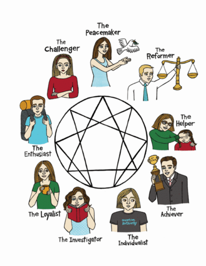

# Membuat Tes Kepribadian Enneagram dengan jQuery dan W3 CSS

Salam psikologi!

Teknologi membantu kehidupan kita sehari-hari apalagi dengan perkembangan teknologi yang semakin memudahkan bagi siapapun untuk memanfaatkannya, tak terkecuali seorang psikolog. Kali ini kita akan membuat suatu alat tes yang cukup populer bernama Enneagram. Apa itu Enneagram? Link-link berikut ini mungkin dapat membantu Anda:

- https://www.google.co.id/search?q=apa+itu+enneagram
- http://www.isigood.com/wawasan/yuk-kenali-kepribadianmu-dengan-mencoba-tes-kepribadian-enneagram-berikut-ini/
- http://kotakplus.blogspot.co.id/2013/06/kepribadian-menurut-enneagram.html

Untuk tutorial kali ini, saya akan membagikan source code dan demo aplikasi yang sudah jadi. Berikut ini adalah linknya:

- demo: http://muhammadzaini.com/enneagram
- source code: https://github.com/mzaini30/enneagram/tree/gh-pages

Berikut ini adalah screenshot aplikasi:

## Pembahasan Struktur File

Untuk memudahkan pengorganisasian file, maka saya mengelompokkan file-file tersebut sesuai dengan tipenya. File-file style saya jadikan satu, file-file javascript saya jadikan satu, lalu file-file library, saya jadikan satu dalam folder bin.

```
bin
... css
... ... w3.css
... js
... ... jquery.min.js
css
... style.css
gambar
... enneagram.gif
js
... app.js
index.html
```

## Persiapan Sebelum Pembahasan Script

Sebelum membahas script, ada baiknya Anda mengunduh terlebih dahulu repository GitHubnya ( https://github.com/mzaini30/enneagram/tree/gh-pages ) dan berikut ini beberapa cuplikan script yang akan kita bahas:

Script index.html

```html
<!DOCTYPE HTML>
<html>

<head>
    <meta charset="utf-8">
    <meta content="width=device-width, initial-scale=1" name="viewport">
    <title>Tes Kepribadian Enneagram</title>
    <link rel="stylesheet" href="bin/css/w3.css" />
    <link rel="stylesheet" href="css/style.css" />
    <script src="bin/js/jquery.min.js"></script>
    <script src="js/app.js"></script>
</head>

<body class="w3-sand">
    <div class="w3-container w3-red">
        <h1>Tes Kepribadian Enneagram</h1>
    </div>
    <div class="w3-container soal prolog">
        <h2>Apa itu <em>enneagram</em>?</h2>
        <p class="w3-justify"> Adalah salah satu metode yang bisa digunakan untuk mengetahui kepribadian seseorang. Enneagram diartikan sebagai “sebuah gambar bertitik sembilan”. Metode ini dikabarkan telah ada sejak ratusan tahun yang lalu dan diajarkan secara lisan dalam suatu kelompok sufi di Timur Tengah, hingga akhirnya mulai berkembang di Amerika Serikat sekitar tahun 1960-an. Kepribadian manusia dalam sistem enneagram, terbagi menjadi 9 tipe. Kesembilan tipe kepribadian tersebut adalah :</p>
        
        <div class="w3-section">
            <button class="w3-btn-block w3-teal jawab jawab-prolog">MULAI</button>
        </div>
    </div>
    <div class="w3-container soal soal-a1">
        <p>Apakah yang paling kamu inginkan dari orang lain?</p>
        <div class="w3-section">
            <button class="w3-btn-block w3-teal jawab jawab-a">hormat dan kepatuhan</button>
        </div>
        <div class="w3-section">
            <button class="w3-btn-block w3-teal jawab jawab-b">kasih sayang dan penerimaan</button>
        </div>
        <div class="w3-section">
            <button class="w3-btn-block w3-teal jawab jawab-c">jarak dan privasi</button>
        </div>
    </div>

	<!-- beberapa baris script tidak ditampilkan -->

    <div class="w3-container soal soal-b7">
        <p>Ketika merenungkan kembali tindakan yang sudah dilakukan, gagasan apa yang sering muncul?</p>
        <div class="w3-section">
            <button class="w3-btn-block w3-teal jawab jawab-d">sebenarnya saya mampu melakukannya dengan mudah, tapi ternyata usaha saya berlebihan</button>
        </div>
        <div class="w3-section">
            <button class="w3-btn-block w3-teal jawab jawab-e">sering terpaksa kompromi meski sebenarnya tidak perlu</button>
        </div>
        <div class="w3-section">
            <button class="w3-btn-block w3-teal jawab jawab-f">ternyata masalahnya tidak sesulit yang saya duga</button>
        </div>
    </div>
    <div class="w3-container soal hasil-1">
        <p>Kamu adalah...</p>
        <h2> Tipe Pembaharu (Reformer / Perfeksionis)</h2>
        <p>Kekuatan energinya adalah ingin menjadi benar dan bersifat perfeksionis dalam melakukan tugasnya. Mulai dari menyusun perencanaan dan persiapan yang baik sebelum melakukan sesuatu, sangat teliti, hati hati dan ingin tampil sempurna dalam seluruh pekerjaan dan tugas yang dimandatkan kepadanya.</p>
        <p>Namun biasanya orang dalam tipe ini sering kali menuntut orang lain harus tampil sempurna seperti dirinya, dan cenderung tidak fleksibel dan terlalu dogmatis kepada anak buah. Kelemahannya, sering kali beranggapan bahwa banyak orang yang tidak tahu apa yang harus diperbuat, sehingga menuntut setiap orang berbuat seperti dia.</p>
    </div>

    <!-- beberapa baris script tidak ditampilkan -->

</html>
```

Script style.css

```css
.w3-btn-block {
    overflow: visible;
    white-space: normal;
}

img {
    margin: auto;
    max-width: 100%;
    display: block;
}
```

Script app.js

```javascript
$(function() {


    pertama = [0, 0, 0]
    kedua = [0, 0, 0]
    tipe = 0


    $(".jawab-a").click(function() {
        pertama[0]++
    })

	// beberapa baris script tidak ditampilkan

    sembunyi = function() {
        $(".soal").hide()
    }


    sembunyi()
    $(".prolog").show()

    $(".jawab-prolog").click(function() {
        sembunyi()
        $(".soal-a1").show()
    })

    $(".soal-a1 .jawab").click(function() {
        sembunyi()
        $(".soal-a2").show()
	})

	// beberapa baris script tidak ditampilkan

    $(".soal-b7 .jawab").click(function() {
        sembunyi()

        largest_pertama = Math.max.apply(Math, pertama)
        posisi_pertama = pertama.indexOf(largest_pertama)

        largest_kedua = Math.max.apply(Math, kedua)
        posisi_kedua = kedua.indexOf(largest_kedua)

        if (posisi_pertama == 0 && posisi_kedua == 0) {
            $(".hasil-8").show()
        } else if (posisi_pertama == 1 && posisi_kedua == 0) {
            $(".hasil-3").show()
        }

        // beberapa baris script tidak ditampilkan

    })

})
```

Adapun untuk w3 css dan jquery, Anda dapat langsung mengunduhnya dari situsnya:

- w3 css
- jquery

## Pembahasan Script

Pertama kita akan membahas seperti apa bentuk pertanyaan enneagram ini.

Jadi, ada 14 pertanyaan yang disajikan. Kalau kita melihat pada script index.html, maka kita akan menemukan ada bagian yang diulang-ulang yaitu `<div class="w3-container soal ...">`. Nah, class soal menandakan bahwa berbagai element di dalamnya adalah satu aitem atau satu pertanyaan beserta opsi. Pada saat halaman dimuat pertama kali, semua class soal dihidden kecuali class prolog, tampak dari script app.js sebagai berikut:

```javascript
sembunyi = function() {
    $(".soal").hide()
}

sembunyi()
$(".prolog").show()
```

Lalu, ketika tombol MULAI yang berada di prolog ditekan, maka semua class soal dihidden dan akan dimunculkan class soal-a1, sebagaimana yang ditunjukkan di script app.js:

```javascript
$(".jawab-prolog").click(function() {
    sembunyi()
    $(".soal-a1").show()
})
```

Lalu, kita mulai pada skoring...

Di awal-awal script app.js, kita mendeklarasikan jawaban a, b, c, sebagai nol dan jawaban d, e, f, sebagai nol (silahkan Anda pelajari tentang cara penghitungan tes kepribadian enneagram), juga . Berikut ini adalah scriptnya (app.js):

```javascript
pertama = [0, 0, 0]
kedua = [0, 0, 0]
```

Setelah kita mendeklarasikannya, kita pun memberi action pada setiap tombol opsi yang ditekan (a, b, c, d, e, f):

```javascript
$(".jawab-a").click(function() {
    pertama[0]++
})

$(".jawab-b").click(function() {
    pertama[1]++
})

$(".jawab-c").click(function() {
    pertama[2]++
})

// beberapa baris script tidak ditampilkan

```

dan

```javascript
$(".soal-a1 .jawab").click(function() {
    sembunyi()
    $(".soal-a2").show()
})

$(".soal-a2 .jawab").click(function() {
    sembunyi()
    $(".soal-a3").show()
})

$(".soal-a3 .jawab").click(function() {
    sembunyi()
    $(".soal-a4").show()
})

// beberapa baris script tidak ditampilkan

```

Setelah kita sampai pada tes yang terakhir, semuanya akan dijumlahkan dan ditentukan tipe kepribadian apa yang diberitahukan oleh tes tersebut:

```javascript
largest_pertama = Math.max.apply(Math, pertama)
posisi_pertama = pertama.indexOf(largest_pertama)

largest_kedua = Math.max.apply(Math, kedua)
posisi_kedua = kedua.indexOf(largest_kedua)

if (posisi_pertama == 0 && posisi_kedua == 0) {
    $(".hasil-8").show()
} else if (posisi_pertama == 1 && posisi_kedua == 0) {
    $(".hasil-3").show()
} else if (posisi_pertama == 2 && posisi_kedua == 0) {
    $(".hasil-7").show()
}

// beberapa baris script tidak ditampilkan

```

## Kritik dan Saran

Aplikasi ini tentunya masih memiliki beberapa kekurangan yang kedepannya mungkin akan saya perbaiki atau kita perbaiki bersama melalui kontribusi repository GitHub aplikasi ini ( https://github.com/mzaini30/enneagram/tree/gh-pages ). Berikut ini adalah beberapa kekurangan sementara yang saya temukan:

- Belum progressive web app sehingga masih membutuhkan internet untuk mengaksesnya.
- Script masih belum memenuhi kriteria Don't Repeat Yourself (DRY)
- Setelah menampilkan hasil, tidak tersedia tombol kembali ke beranda sehingga mengharuskan pengunjung untuk mereload halaman jika ingin kembali melakukan pemeriksaan psikologi

Tentu masih banyak lagi kekurangan yang terdapat pada aplikasi ini. Anda dapat berkontribusi dengan:

- melalui komentar disqus yang tersedia di bawah tutorial ini
- melalui issue di repository github: https://github.com/mzaini30/enneagram/issues
- melalui messenger apps maupun sosial media yang tersedia di situs saya: http://muhammadzaini.com

Sekian tutorial dari saya. Ciao...
